# Laço Solidare

Esta aplicação web foi desenvolvida para a cadeira **Projetos 2** da **CESAR School**, em que temos como cliente o **Instituto Solidare**, uma organização sem fins lucrativos, que tem como missão promover o desenvolvimento social, político e pedagógico de crianças e adolescentes em situação de vulnerabilidade social e financeira.​ 

Nosso projeto **Laço Solidare** visa automatizar os processos do sistema de apadrinhamento e prover, por meio da plataforma, troca de mensagens entre padrinhos e apadrinhados.

### Principais Funcionalidaes da Aplicação
- Automatização do processo de Apadrinhamento 
- Armazenamento no banco de dados
- Processo completo de Apadrinhamento
- Apadrinhamento Aleatório
- Gerenciamento dos padrinhos e crianças
- Filtragem de crianças a serem apadrinhadas

---

## 👩‍💻 Equipe

**Integrantes:**

* [Amanda Luz Chaves](https://github.com/amandaaluzc) - alc2@cesar.school  
* [Augusto Malheiros de Souza](https://github.com/goodguto) - ams10@cesar.school  
* [Brenda Luana Correia Bezerra](https://github.com/brendalu2005) - blcb@cesar.school  
* Caio Vilela - chbv@cesar.school  
* Carolina Alves - cmag@cesar.school  
* Clara Pereira - cplc@cesar.school  
* [Eduardo Albuquerque Alves Barbosa](https://github.com/eduaab) - eaab@cesar.school  
* [Heloisa Barros](https://github.com/heloisaborba) - hbbs@cesar.school  
* [João Carlos Melo Brennand de Souza Mendes](https://github.com/joaocm1804) - jcmbsm@cesar.school  
* [Lucas Menezes Santana](https://github.com/ucasmenezes08) - lms4@cesar.school  
* Lucas Tavares - ltas@cesar.school  

**Orientadora:**  
* Manuela Beatriz Pedrosa Correia

---

## SRs

<strong>✅ SR1</strong>

### 📜 Histórias de Usuário - Funcionalidades do Site "Laço Solidare"

#### História 02: Escolher uma criança de maneira aleatória

**Cenário 1**: Como usuário, ao visualizar as crianças na página de apadrinhamento do site “Laço Solidare”, gostaria de escolher uma criança de maneira aleatória, para não precisar tomar essa decisão tão difícil.

- **Dado** que o usuário está visualizando a página de apadrinhamento  
- **Quando** o usuário seleciona o botão “Escolha por Mim”  
- **Então** o site lhe indica uma criança para que ele possa apadrinhar  

#### História 03: Visualizar a descrição das crianças

**Cenário 1**: Como usuário, ao visualizar as crianças na página de apadrinhamento do site “Laço Solidare”, gostaria de poder ver mais informações sobre ela, para conseguir escolher quem quero apadrinhar.

- **Dado** que o usuário está visualizando a página de apadrinhamento  
- **Quando** o usuário seleciona o ícone de alguma criança  
- **Então** é exibido um modal com o nome, idade e sonho da criança escolhida  

🔗 [Link das Histórias de Usuário](https://docs.google.com/document/d/19KuOhW94pM85Zn40VEzIR0fK93RL_y0x_1isjKfzXWE/edit?usp=sharing)

---

### ✏️ Sketches

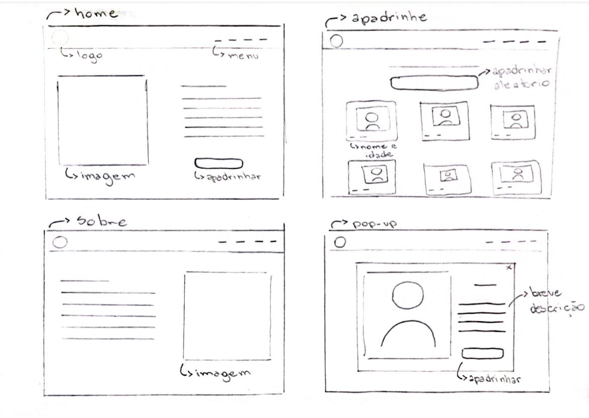
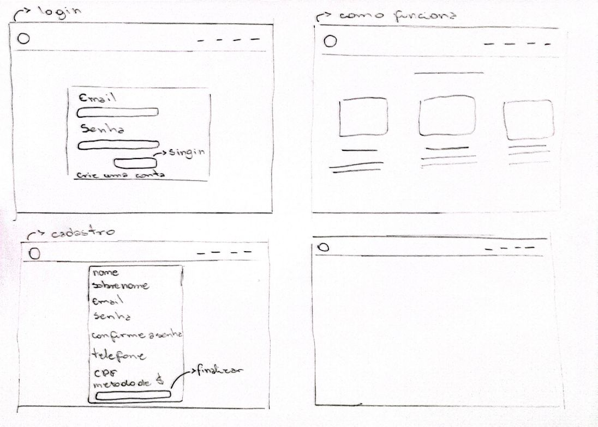

---

### 🎥 Screencast

[Screencast protótipo de baixa](https://youtu.be/LvRqtPp6ix8?feature=shared)

[Screencast Aplicação](https://youtu.be/z5TkcGMuzKM?feature=shared)

---

### 📋 Diagrama de Atividades

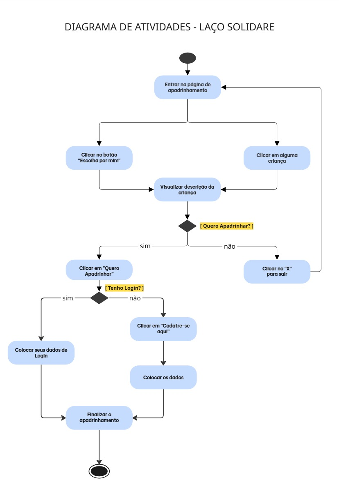

---

### 📌 Backlog e Sprint

#### Backlog:
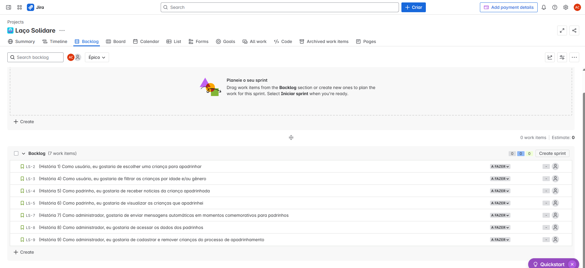

#### Sprint SR1:
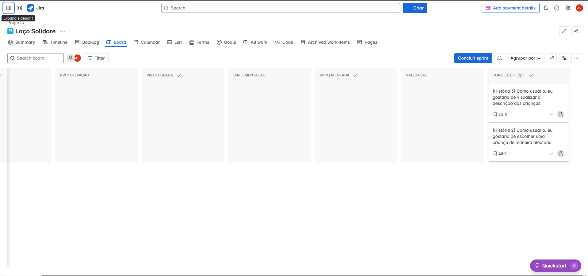

---

### 🐛 Issue/Bug Tracker

* Issue #2  
  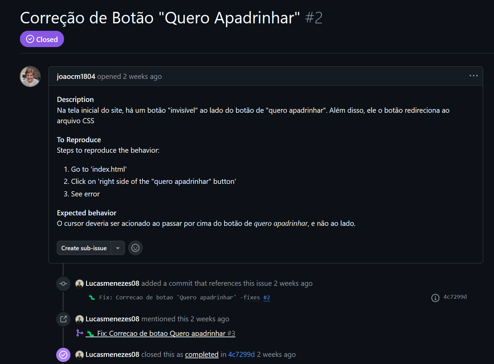

* Issue #8  
  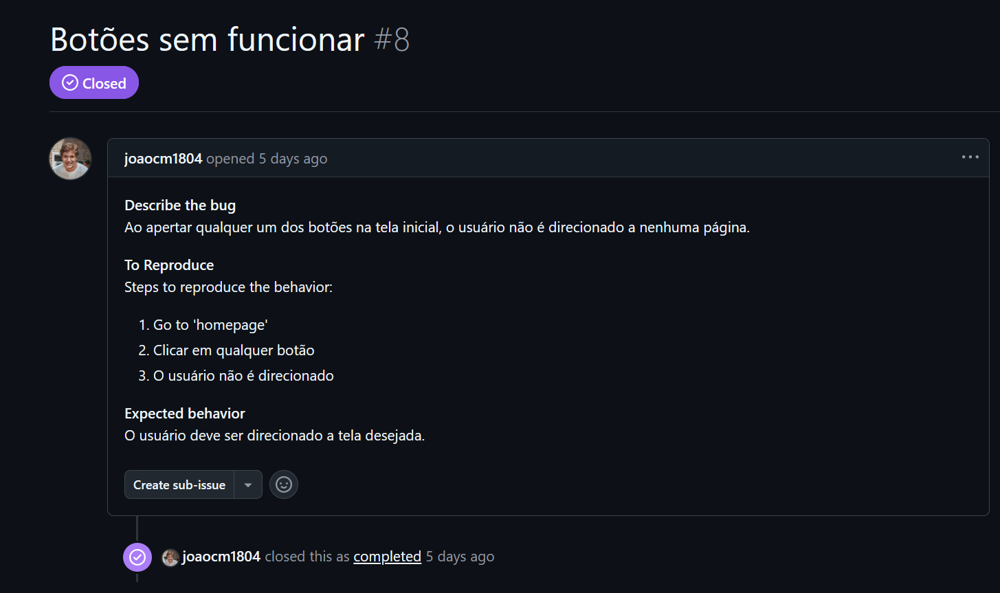

* Issue #9  
  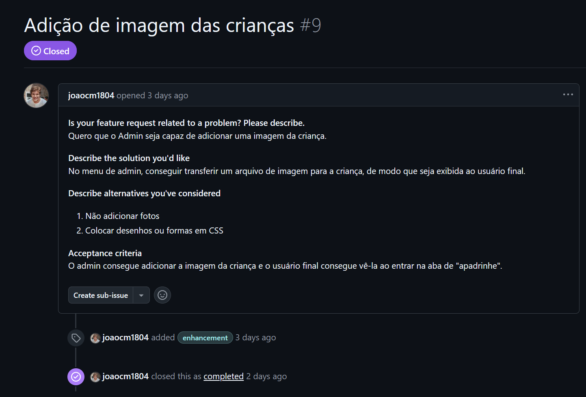

* Issue #13  
  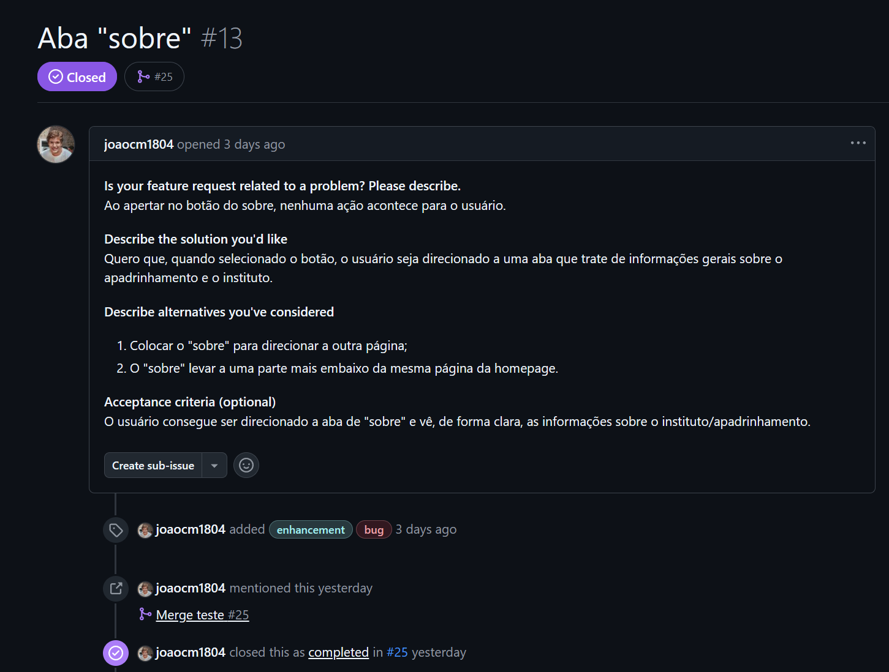

* Issue #14  
  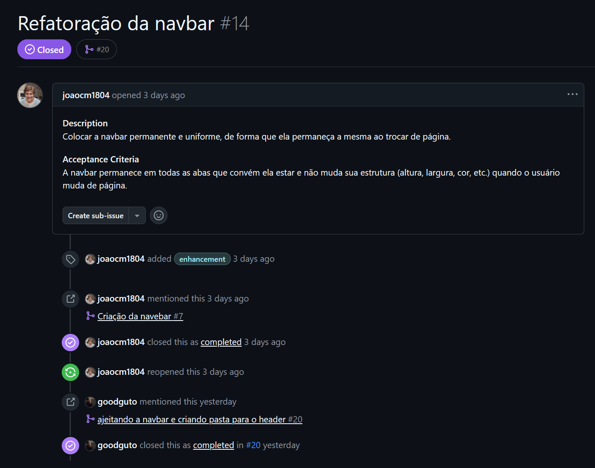

* Issue #16  
  

* Issue #21  
  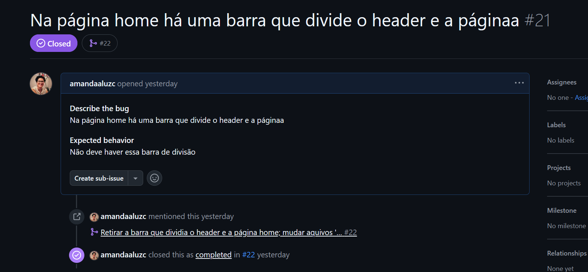

* Issue #24  
  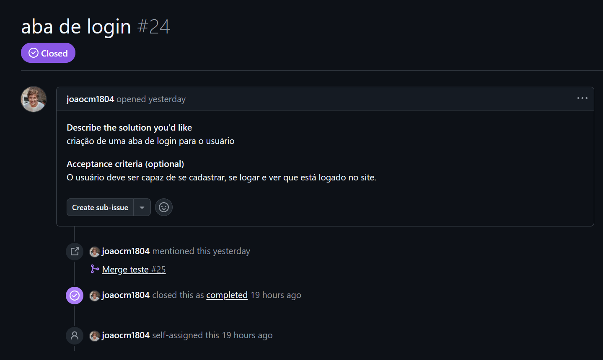

* Issue #26  
  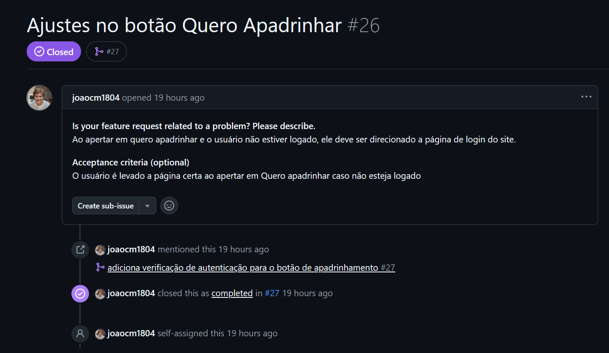

---

### 🚀 Deployment

🔗 [Site no Ar](https://lacosolidare-abcshnhxerhqbgga.brazilsouth-01.azurewebsites.net/)

🔗 [Página do Admin](https://lacosolidare-abcshnhxerhqbgga.brazilsouth-01.azurewebsites.net/admin)

#### Dados Admin
- **Login**: G5PJLACOSOLIDAREADMIN  
- **Senha**: #GRUPO5LS2025

---

### 👯‍♂️ Relato de programação

📄 [Documento da Programação em Par](https://docs.google.com/document/d/14FbzH0i16PJSR0gSy0T5qJmpo38lusP7hxhiUT6zfVk/edit?usp=sharing)

<strong>✅ SR2</strong>

### 📜 Histórias de Usuário Implementadas

#### História 01: Como usuário, eu gostaria de escolher uma criança para apadrinhar 
#### História 04: Como usuário, eu gostaria de filtrar as crianças por idade e/ou por gênero
#### História 05: Como padrinho, eu gostaria de visualizar as crianças que apadrinhei 
#### História 06: Como administrador, eu gostaria de gerenciar os padrinhos
#### História 07: Como administrador, eu gostaria de cadastrar crianças
#### História 08: Como administrador, eu gostaria de gerenciar as crianças

🔗 [Link das Histórias de Usuário e Cenários Atualizados](https://docs.google.com/document/d/1u4eRhVVwZgFhZe1qXeQgEIQJguWyihG8sPGUJnuedxc/edit?usp=sharing)

---

### ✏️ Sketches

---

### 🎥 Screencast

[Screencast protótipo do Figma]()

[Screencast Aplicação]()

[Screencast Testes Automatizados]()

---

### 📋 Diagrama de Atividades

---

### 📌 Backlog e Sprint

#### Backlog:

#### Sprint SR1:

[Link para acessar o JIRA](https://focustimenow.atlassian.net/jira/software/projects/LS/boards/34?sprintStarted=true)

---

### 🐛 Issue/Bug Tracker

* Issue #2  
  

---

### 🚀 Deployment

🔗 [Site no Ar]()

🔗 [Página do Admin]()

#### Dados Admin
- **Login**: G5PJLACOSOLIDAREADMIN  
- **Senha**: #GRUPO5LS2025

---

### 👯‍♂️ Relato de programação

📄 [Documento da Programação em Par]()

